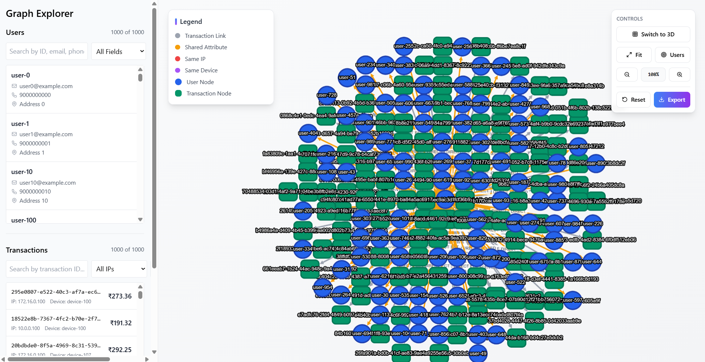
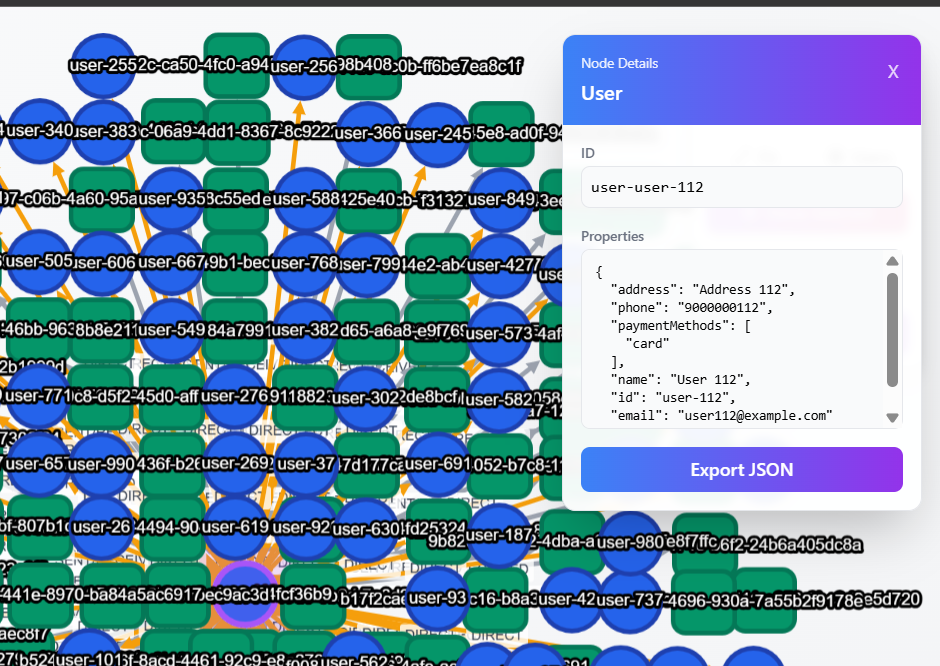
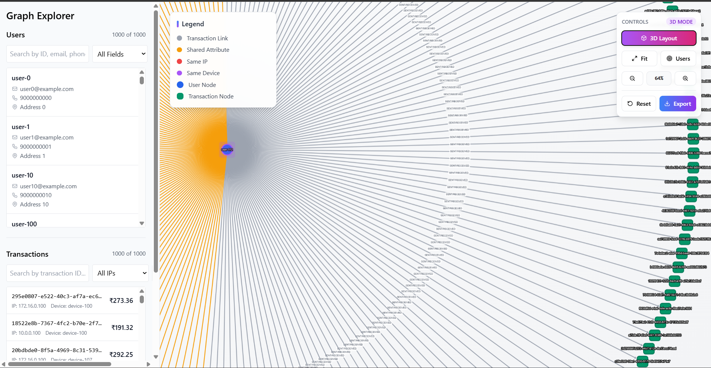

# Graph Visualization Prototype

## Description

Build a prototype system to visualize relationships between user accounts using
transaction data and shared attributes in a graph database environment. The
system should use AWS Neptune or a similar graph database (e.g., Neo4j) for
graph storage and querying, inspired by Flagright's FRAML API.

## Docker Setup

To get the project running locally using Docker, follow these steps:

1.  **Build and Start the Containers**

    Use `docker-compose` to build the images and start the services (backend, frontend, and Neo4j database):

    ```bash
    docker-compose up --build
    ```

    This command will build the Docker images for the frontend and backend services as defined in their respective `Dockerfile`s and start all services. The frontend will be accessible at `http://localhost:5173`.

## Dockerizing this Repo

This repository is already set up to be containerized using Docker. Here’s how it’s structured:

- `docker-compose.yml`: This file at the root of the project orchestrates the different services (frontend, backend, database).
- `backend/Dockerfile`: Defines the environment and steps to build the Node.js backend service.
- `frontend/Dockerfile`: Defines the environment and steps to build the React frontend service.

To containerize this repository, you can run the build command:

```bash
docker-compose build
```

## Generate Script Run Command

To populate the database with test data, you can run the data generation scripts.

1.  **Exec into the backend container:**

    First, find the name of your running backend container:

    ```bash
    docker ps
    ```

    Then, execute a shell inside it:

    ```bash
    docker exec -it <backend_container_name_or_id> /bin/sh
    ```

2.  **Run the data generation script:**

    Once inside the container, you can run the script to generate data:

    ```bash
    # For a large dataset
    node src/scripts/generateData.js

    # For a smaller test dataset
    node src/scripts/generateSmallTestData.js
    ```

    Final Step – Accessing the Frontend

After building the containers, generating the data, and running:

docker-compose up

3. **You can access the frontend application at:**

```bash
http://localhost:3000
```

Application Snapshots
Graph View



Node Details Panel



3D View


